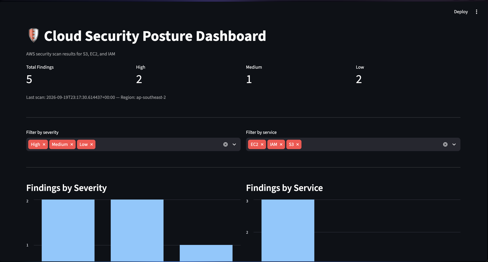
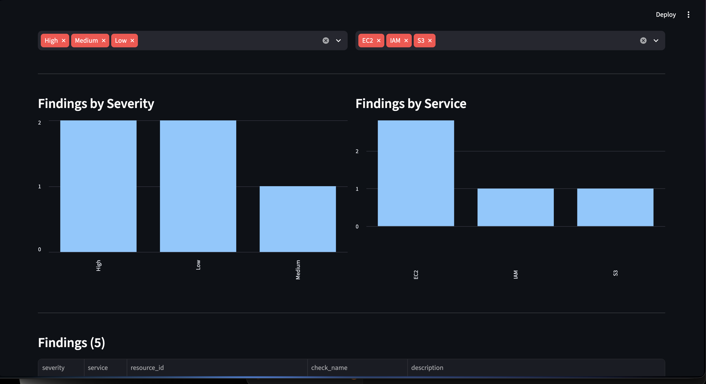
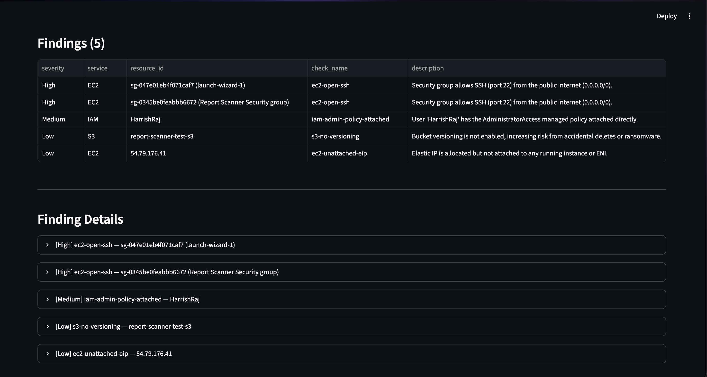
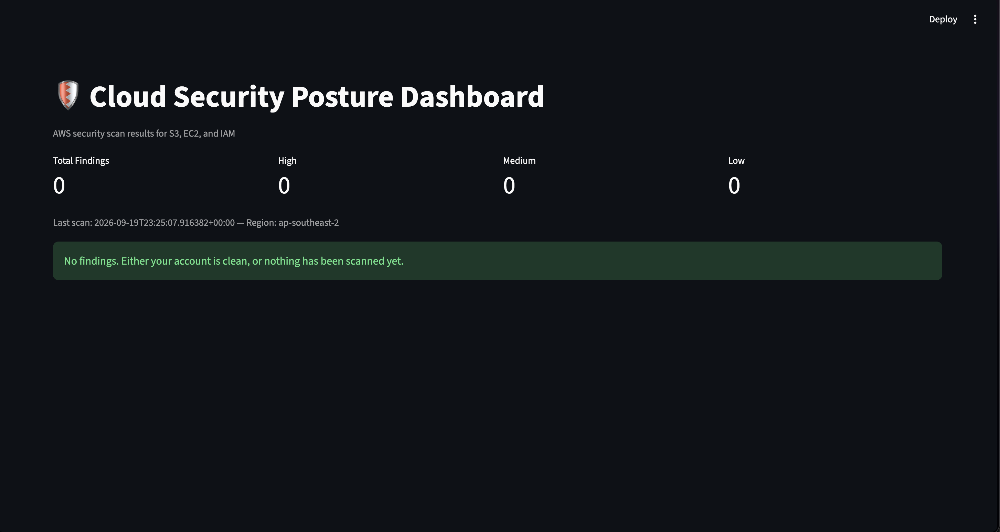

# Cloud Security Posture Scanner

A Python tool that audits an AWS account for common security misconfigurations across S3, EC2, and IAM, and visualizes the results in an interactive Streamlit dashboard.

Built to understand how cloud security posture management (CSPM) tools like Prowler and ScoutSuite actually work under the hood — not by wrapping them, but by implementing the core detection logic from scratch against the real AWS APIs.


*Summary metrics after the deliberate misconfigurations*


*Findings breakdown by severity and service*


*Full findings table with remediation details*


*Clean scan after all five issues were remediated*


## Why this exists

Manually checking an AWS account for misconfigurations — open security groups, public S3 buckets, missing MFA — doesn't scale, and it's easy to miss something. Existing tools like Prowler and ScoutSuite solve this well, but I wanted to understand *how* they solve it, not just run them. This project reimplements a focused subset of their checks to demonstrate that understanding: reading AWS's own audit data (credential reports, bucket configurations, security group rules) and applying security logic against it.

## What it checks

**S3** (5 checks)
- Public bucket ACL (grants to `AllUsers` / `AuthenticatedUsers`)
- Public bucket policy (`Principal: "*"` with `Allow`)
- Block Public Access disabled
- Missing default encryption
- Versioning disabled

**EC2** (2 checks)
- Security groups allowing SSH (22) or RDP (3389) from `0.0.0.0/0`
- Security groups allowing all traffic from `0.0.0.0/0`
- Unattached Elastic IPs

**IAM** (5 checks)
- Console users without MFA enabled
- Root account has an active access key
- Root account has no MFA
- Access keys older than 90 days
- Access keys never used / unused 90+ days
- `AdministratorAccess` attached directly to a user (rather than via a group)

## Architecture

```
main.py                 → orchestrator: authenticates, runs each check module,
                           combines results, writes findings.json
dashboard.py             → Streamlit app that reads findings.json and renders
                           summary metrics, filters, charts, and finding detail
scanner/
  models.py              → Finding dataclass — the shared structure every
                           check returns, so results from S3/EC2/IAM can be
                           combined into one report
  s3_checks.py            → S3 bucket checks
  ec2_checks.py           → EC2 security group + Elastic IP checks
  iam_checks.py           → IAM credential report + policy checks
```

Each `*_checks.py` module is independent — it takes a `boto3.Session` and returns a list of `Finding` objects. `main.py` doesn't know or care how each check works internally; it just orchestrates and aggregates. This separation made it possible to build and test each service's checks independently.

IAM checks pull AWS's built-in **credential report** (`generate_credential_report` / `get_credential_report`) rather than looping per-user — the same efficient approach production CSPM tools use, since it's a single API call that returns audit data for every IAM user at once.

## Setup

Requires an AWS IAM user with `IAMReadOnlyAccess` and `SecurityAudit` managed policies (read-only — no write access needed or used).

```bash
pip install -r requirements.txt
aws configure --profile <your-profile>
```

## Usage

Run a scan:
```bash
python3 main.py --profile <your-profile> --region <region>
```
Writes results to `findings.json`.

View results in the dashboard:
```bash
streamlit run dashboard.py
```
Opens at `localhost:8501`. Refresh the browser after rescanning to pick up new results.

## Real findings from testing

I ran this against my own AWS account (not a simulated environment) and used it to find and fix real misconfigurations.

**IAM — missing MFA (found and fixed)**
The scanner flagged my primary IAM user for having console password access with no MFA device — a genuine gap. I enabled MFA and reran the scan to confirm it cleared.

**Deliberately introduced misconfigurations, then remediated:**

| Finding | Severity | Service |
|---|---|---|
| Security group allows SSH (22) from 0.0.0.0/0 | High | EC2 |
| Security group allows SSH (22) from 0.0.0.0/0 (2nd group) | High | EC2 |
| `AdministratorAccess` attached directly to user | Medium | IAM |
| S3 bucket versioning disabled | Low | S3 |
| Elastic IP allocated but unattached | Low | EC2 |

After fixing all five (removing the open rules, detaching the direct admin policy, enabling versioning, releasing the EIP), a rescan returned 0 findings — confirming both the checks and the remediations were correct.

The second open-SSH security group (`launch-wizard-1`) was one I hadn't deliberately created — it turned out to be a default group auto-created by an earlier EC2 instance launch through the console. The scanner caught a real gap I wasn't actively aware of.

## Limitations

- **IAM credential report caching**: AWS's credential report refreshes on its own schedule (up to ~4 hours), not on demand. A fix made in the AWS console may not be reflected in the next scan immediately — I hit this directly while testing the MFA fix.
- **Group-inherited permissions not checked**: The `iam-admin-policy-attached` check only inspects policies attached *directly* to a user (`list_attached_user_policies`), not permissions inherited through group membership. Admin access granted via a group carries the same practical risk but currently isn't flagged, since the check specifically targets the anti-pattern of bypassing groups.
- **S3 checks are account-wide, EC2 checks are region-scoped**: S3 bucket names are globally unique, so `list_buckets()` returns every bucket in the account regardless of the `--region` flag. EC2 resources (security groups, Elastic IPs) are strictly regional, so a scan only covers whichever single region is passed. Scanning multiple regions currently requires running the tool once per region.
- **ACL check untested against a real public grant**: AWS's current default (`Bucket owner enforced`) disables ACLs account-wide on new buckets, which blocked testing the `s3-public-acl` check directly. The check remains in place for accounts/buckets where ACLs are still enabled.
- **No pagination testing at scale**: checks were validated against a small number of resources; behavior on accounts with hundreds of buckets/security groups/users hasn't been tested.

## Future improvements

- `--all-regions` flag to run EC2 checks across every enabled region in one pass
- Check group-inherited IAM permissions, not just directly-attached ones
- Add a `--severity-threshold` flag to fail CI/CD pipelines on High findings
- Export findings to CSV/PDF for sharing outside the dashboard
- Historical tracking — store scan results over time to show posture trending

## Tech stack

Python, boto3, Streamlit, pandas
